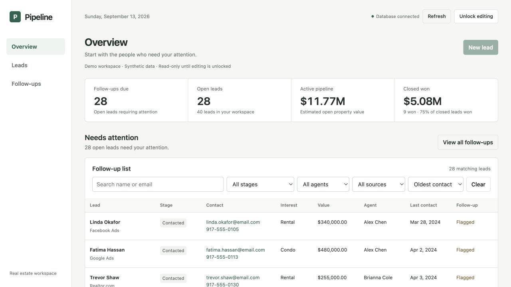

# CRM Pipeline V2

A real estate lead workspace built with vanilla JavaScript, FastAPI, and PostgreSQL.

Open the workspace to see which leads need attention, review their contact details and pipeline stage, and keep records current.

[Public demo](https://crm-pipeline-v2.onrender.com/) · [API documentation](https://crm-pipeline-v2.onrender.com/docs) · [Verification](docs/VERIFICATION.md)

The demo uses synthetic data. Visitors can browse; editing requires a private access key. Render's free service may take about a minute to wake. Its free database expires 30 days after creation, so the hosting plan must change before then to keep the demo available.

## What it does



Screenshot: V2 Overview captured locally with the canonical synthetic dataset. The same redesign is deployed publicly; evidence is recorded in [verification](docs/VERIFICATION.md).

The interface puts follow-ups first, with a searchable lead directory, contact links, grouped editing forms, and an expandable pipeline summary. Small screens use labeled lead cards.

- Create, edit, and delete leads with persistent database storage.
- Search names and emails; filter by stage, agent, or source; sort and paginate.
- View SQL-backed pipeline totals, stage counts, agent results, and lead sources.
- Follow up with open leads that are flagged, never contacted, or at least seven days stale.
- Validate names, email, dates, stages, and positive monetary values, including cents.
- Browse in read-only mode or unlock editing with a server-configured key.

Analytics cover all leads; directory filters affect only the table. Close rate is won / (won + lost). Outcome follows stage automatically. Dates use UTC calendar days.

## Architecture

```text
Browser: index.html + static/
             ↓ fetch / JSON
FastAPI: validation + access checks
             ↓ parameterized Psycopg queries
PostgreSQL: leads + migration history
```

FastAPI serves the frontend and API from one origin. There is no frontend build step or ORM. Numbered SQL migrations add constraints and indexes in a transaction. The CSV is a seed; PostgreSQL is authoritative after import.

V1 combined PostgreSQL analysis with a static dashboard. Its original page is preserved in [the V1 archive](docs/v1-dashboard.html). V2 adds the API, persistent CRUD, validation, authorization, tests, CI, and deployment.

## Run locally

Requires Python 3.12 and a running PostgreSQL 17 server with permission to create databases. From the repository root:

```sh
python3.12 -m venv .venv
source .venv/bin/activate
python -m pip install -r requirements-dev.txt
cp .env.example .env
createdb crm_pipeline
```

Set `DATABASE_URL` in `.env` for your database. Generate `API_KEY` with `python -c 'import secrets; print(secrets.token_urlsafe(36))'` and save it in `.env`. This file is ignored by Git. Keep `PUBLIC_DEMO=false` for private reads, or use `true` for synthetic public demos.

```sh
python -m backend.init_db --seed
python -m uvicorn backend.main:app --reload --no-access-log
```

Open [localhost:8000](http://127.0.0.1:8000/), then unlock with your key. Opening `index.html` directly cannot connect to the backend. The key stays in browser memory and is cleared on reload.

Initialization applies unapplied files in `backend/migrations`. `--seed` imports only into an empty table; `--seed-on-create` imports only when first creating the table. Existing invalid records must be corrected before the integrity migration succeeds. **The historical `crm_setup.sql` drops leads; never run it on data you want to preserve.**

## Tests

Use a separate test database. Each integration test creates and removes its own schema; the suite never falls back to the application's database.

```sh
createdb crm_pipeline_test
TEST_DATABASE_URL=postgresql://localhost/crm_pipeline_test python -m pytest -q
```

49 tests passed locally and from a clean clone. GitHub Actions runs PostgreSQL 17 integration tests and a JavaScript syntax check. Coverage includes CRUD, validation, authorization, search/filter/sort/pagination, analytics, follow-up boundaries, migrations, seed idempotency, and database failures.

## Deployment

[Render setup and operations](docs/DEPLOYMENT.md) describe the `render.yaml` Blueprint: one Python web service and a PostgreSQL database. Render generates the access key and supplies the private database connection. The start command applies migrations and seeds only on first creation.

See [verification evidence](docs/VERIFICATION.md) for the current deployment checks, and [engineering decisions](docs/DECISIONS.md) for tradeoffs.

## Data and limitations

The canonical CSV contains 40 synthetic leads, $17,673,000 in modeled property value, 9 won and 3 lost leads. Values are not earned revenue or real transactions. Historical V1 snapshots differ from this CSV.

This is a single-workspace portfolio app. A shared key provides no user identity, roles, or tenant isolation. Deletes are permanent; same-field concurrent edits use last-writer-wins. Database connections open per request. Before real team use, add identity-based authorization, audit history, backups with restoration checks, and concurrency/load testing. No AI or predictive scoring is used.

Future hypotheses are contact history, tasks/next actions, and property associations, subject to agent feedback. Live MLS integration is deferred and would require approved provider access and licensing. None of these features is implemented in V2.
