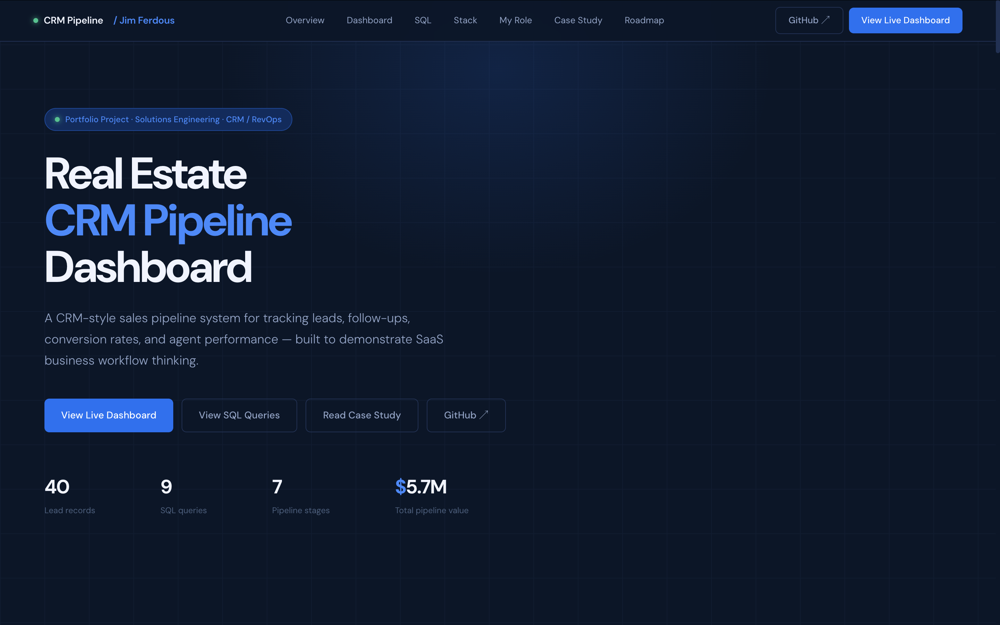
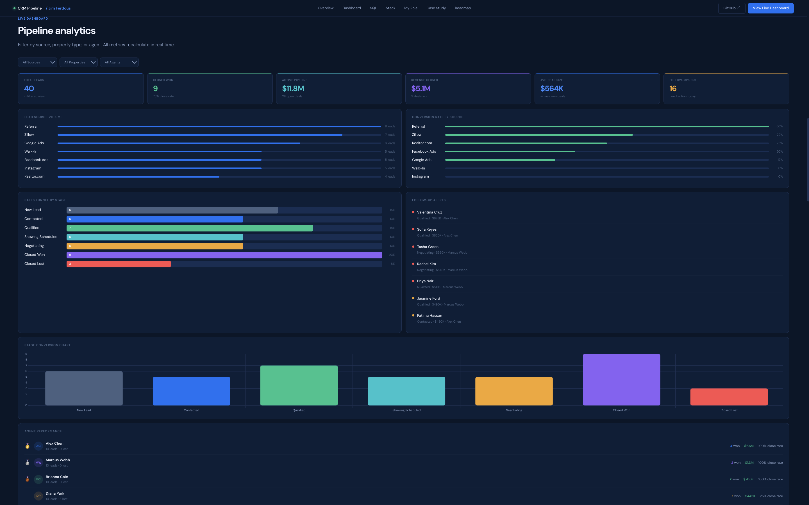
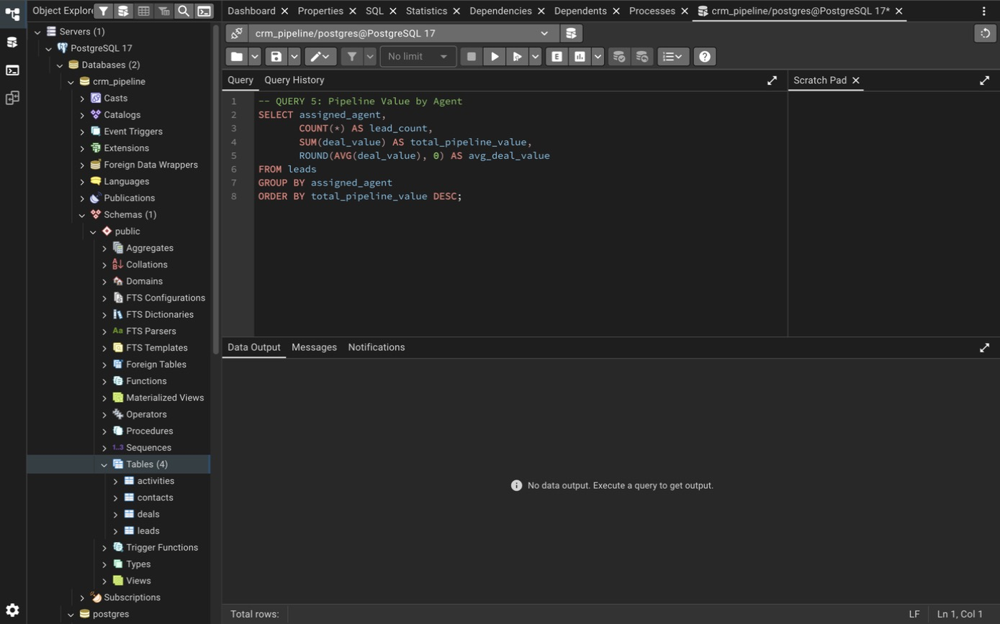
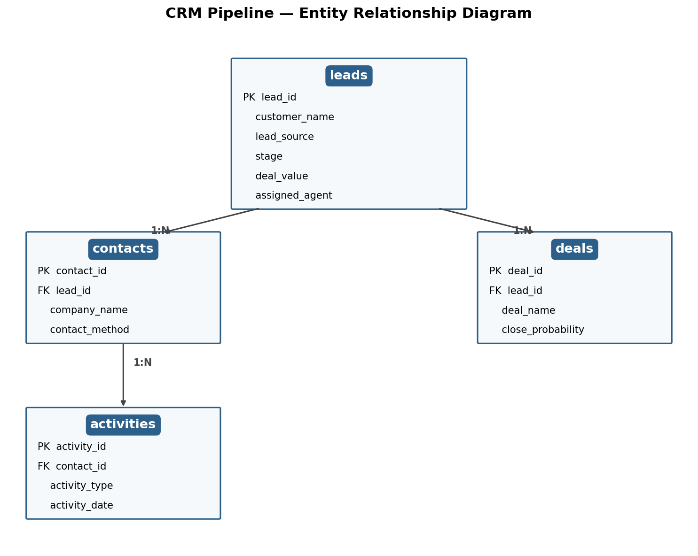
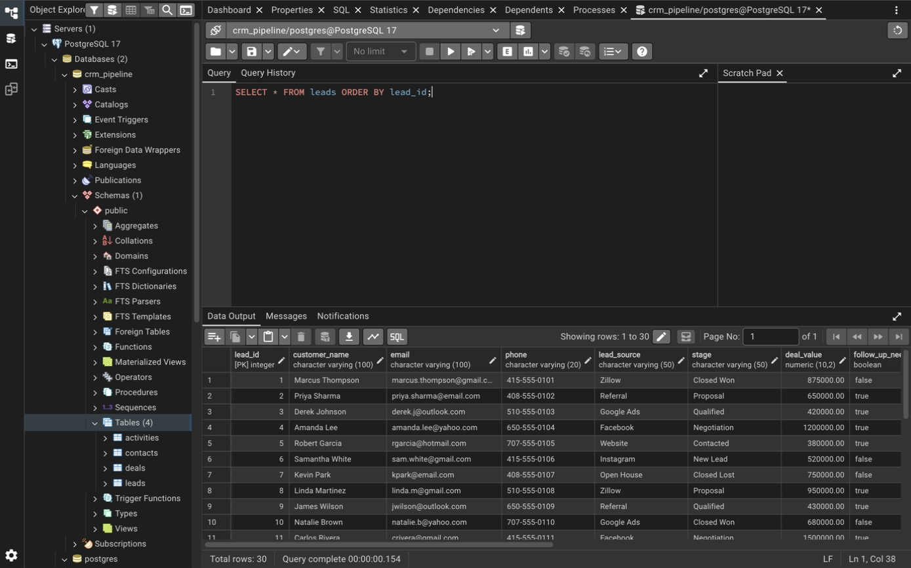
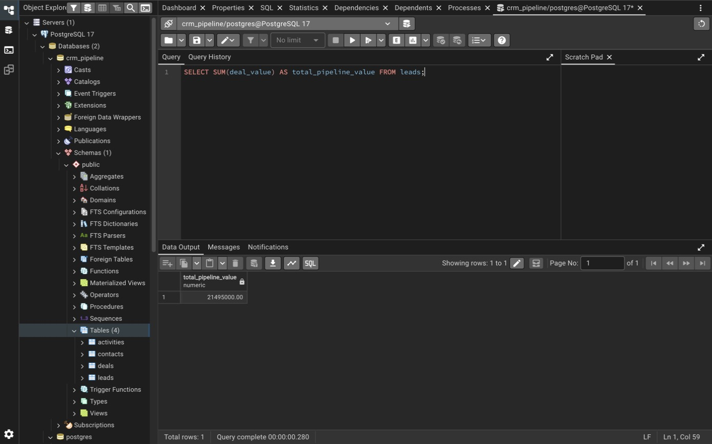
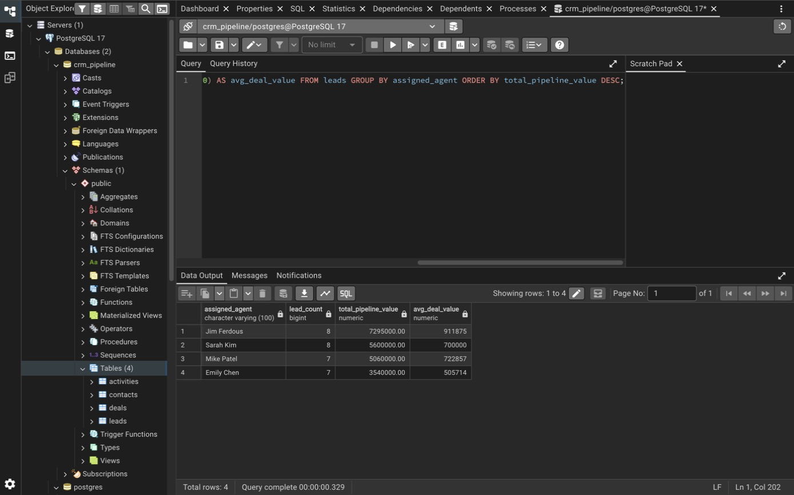

# Real Estate CRM Pipeline Dashboard

**Live Site:** https://jimdous.github.io/crm-pipeline-project/
**Demo Video:** *(coming soon)*

A full-stack CRM portfolio project demonstrating SaaS thinking, database design, SQL analytics, and business reporting — built to showcase Solutions Engineering and RevOps skills.

---

## Project Overview

This project simulates a real-world CRM pipeline system for a real estate agency. It tracks leads from first contact through closed deal, supports multiple agents, and provides SQL-powered business analytics across a normalized PostgreSQL database.

A recruiter opening this repo will find: a live frontend, a production-style database, and demonstrated ability to ask and answer business questions with SQL.

### Homepage


### Dashboard


---

## Business Problem

Real estate agencies struggle to track lead quality, agent performance, and pipeline health across sources. This project models that problem — showing how a CRM database can answer questions like:

- Which lead source generates the most revenue?
- Which agent has the highest close rate?
- How much total pipeline value is active right now?
- Which leads need follow-up today?

---

## CRM Workflow

```
Lead Captured → Contacted → Qualified → Proposal → Negotiation → Closed Won / Lost
```

Each lead is linked to a contact record, an optional deal, and a log of activities — matching how real SaaS CRMs like Salesforce and HubSpot are structured.

---

## Technology Stack

| Layer | Tool |
|---|---|
| Frontend | HTML, CSS, JavaScript |
| Hosting | GitHub Pages |
| Database | PostgreSQL 17 |
| DB GUI | pgAdmin 4 |
| SQL | PostgreSQL SQL |
| Version Control | Git / GitHub |

---

## Database Design

The database `crm_pipeline` contains 4 linked tables:

```
crm_pipeline
├── leads         (30 rows) — core pipeline table
├── contacts      (15 rows) — linked company/contact info
├── deals         (15 rows) — deal records with probability and close date
└── activities    (25 rows) — call logs, tours, offers, closings
```

### leads
| Column | Type | Description |
|---|---|---|
| lead_id | SERIAL PK | Unique identifier |
| customer_name | VARCHAR | Full name |
| email | VARCHAR | Contact email |
| phone | VARCHAR | Phone number |
| lead_source | VARCHAR | Zillow, Referral, Google Ads, etc. |
| stage | VARCHAR | Pipeline stage |
| deal_value | DECIMAL | Estimated deal value |
| follow_up_needed | BOOLEAN | Needs action today |
| assigned_agent | VARCHAR | Jim Ferdous, Sarah Kim, Mike Patel, Emily Chen |
| created_date | DATE | Lead creation date |
| last_contact_date | DATE | Most recent contact |
| property_interest | VARCHAR | Condo, Single Family, Luxury, Commercial |
| lead_score | INTEGER | Engagement score 0–100 |
| outcome | VARCHAR | Purchased, Lost, NULL |
| city | VARCHAR | Bay Area city |
| budget | DECIMAL | Buyer budget |

### contacts
Linked to leads via `lead_id`. Stores company name, preferred contact method, and notes.

### deals
Linked to leads via `lead_id`. Stores deal name, close probability %, and expected close date.

### activities
Linked to contacts via `contact_id`. Logs calls, tours, proposals, and closings with dates and notes.



---

## Entity Relationship Diagram

```
leads (PK: lead_id)
  ├── contacts (FK: lead_id)
  │     └── activities (FK: contact_id)
  └── deals (FK: lead_id)
```



---

## SQL Analysis

All queries are in [`/sql/sql_queries.sql`](sql/sql_queries.sql).

| # | Business Question | Key Result |
|---|---|---|
| 1 | Total pipeline value? | **$21,495,000** |
| 2 | Which sources generate the most leads? | Zillow, Referral, Website |
| 3 | Which source drives the most deal value? | Zillow ($4.31M) |
| 4 | Which leads need follow-up today? | 17 of 30 flagged |
| 5 | Pipeline value by agent? | Jim Ferdous leads at $7.29M |
| 6 | Lead distribution by funnel stage? | New Lead (8) and Contacted (7) largest |
| 7 | Top 10 deals by value? | Range $1.1M–$1.2M |
| 8 | Win/loss rate by agent? | Jim Ferdous 75% win rate |
| 9 | Avg lead score by property type? | Luxury (82.5) leads all types |
| 10 | Weighted deal value from open deals? | Cross-table JOIN with deals table |



**Sample result — Pipeline Value by Agent:**
```
Jim Ferdous    8 leads    $7,295,000    avg $912K
Sarah Kim      8 leads    $5,600,000    avg $700K
Mike Patel     7 leads    $5,060,000    avg $723K
Emily Chen     7 leads    $3,540,000    avg $506K
```





**Total pipeline: $21,495,000 across 30 leads**

---

## Business Insights

### Pipeline Value
Total pipeline value: **$21,495,000** across 30 active leads.

### Lead Sources
Zillow generated the highest pipeline value at $4.31M, followed by Facebook ($3.89M) and Referral ($3.67M). Zillow, Referral, and Website also produced the highest lead volume.

### Pipeline Stages
Most leads sit at the top of the funnel — **New Lead** (8) and **Contacted** (7) — highlighting an opportunity to speed up qualification and follow-up.

### Agent Performance
**Jim Ferdous** manages the largest pipeline at $7.29M across 8 leads, with a 75% win rate — the highest of any agent on the team.

---

## Business Questions Answered

- **Which source drives most revenue?** Zillow ($4.31M), Facebook ($3.89M), Referral ($3.67M)
- **Top agent by pipeline?** Jim Ferdous at $7.29M across 8 leads
- **Active pipeline value?** $21.5M total across 7 lead sources
- **Leads needing follow-up?** 17 of 30 leads flagged for immediate action
- **Highest close rate?** Jim Ferdous at 75% win rate

---

## Future Improvements

- Connect live PostgreSQL data to the frontend dashboard
- Build Power BI / Tableau reports on top of the database
- Add predictive lead scoring using Python
- Expand to multi-region pipeline tracking
- Automate weekly pipeline reports via SQL + email

---

## Author

**Jim Ferdous** — Aspiring Solutions Engineer / RevOps Analyst
GitHub: [@jimdous](https://github.com/jimdous)
Live Project: https://jimdous.github.io/crm-pipeline-project/
